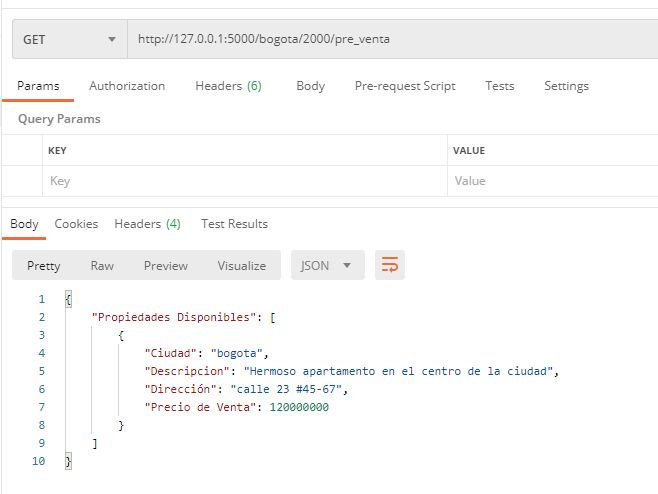

# Tecnologías implementadas:
```
-Python 3.8.10
-Framework Flask 2.0.1
-Mysql Workbench 8 (la DB está en mysql 5.7.12)
-git 2.30
-github
-PyCharm 2018
```


# Análisis Servicio de consulta:

Al realizar el análisis de los requerimientos y la conexión a la DB se detecta que ya existen tablas creadas por un proyecto de Django del cual desconocemos el origen y los archivos del código fuente.
Sin embargo, se tienen las credenciales para acceder a las tablas donde requerimos realizar dichas consultas por lo que no será necesario crear todo un proyecto con Django-RestFramework.
Se decide usar Flask ya que el requerimiento es una consulta básica externa la cual es eficiente, segura y escalable porque realizaremos el microservicio correspondiente, de requerirse más funciones se pueden agregar sin afectar el proyecto principal, además de poder dar mantenimiento al código muy fácilmente.

- Para realizar una busqueda de todos las Propiedades disponibles para los usarios basta con acceder al enlace:
```
http://127.0.0.1:5000/
````


- Para realizar una busqueda por ciudad, fecha de construccion y estado, tendremos que colocar los 3 parametros seguidos de '/' 
```
ej. 
http://127.0.0.1:5000/bogota/2000/pre_venta
```


- De existir algun error o no existir coincidencias con la busqueda se mostrara el mensaje de "Error"


# Análisis Servicio de “Me gusta”:

Como en la DB se implementó las migraciones de Django se deduce que será el Framework principal de trabajo por lo cual existen 2 opciones para realizar esta funcionalidad:

1- Implementación con una APP en Django
- Extendemos los modelos creando una tabla llamada i_like con los sig campos:
```
	- id INT(11)
	- user_autorized 
	- like
```   
 
	
- Extendemos el Modelo "property" agregando un campo extra llamado "total_likes" el cual guardara la cuenta final de todos los likes por propiedad. Esto ayudara al rendimiento de la DB ya que no tendrá que sumar todos los likes cada que se realice una consulta.
- Realizamos una relación de uno a muchos de la tabla “property” hacia la tabla de “i_like”, la cual permitirá registrar el usuario que dio like.
 - Django mandará a la BD el registro del usuario y el like UNO o CERO según sea el caso, esto nos permitirá contabilizarlos.
- Para poder sumar los likes y que estén actualizados puede crearse un Store Procedure en MYSQL que realice esta funcionalidad.
- Django se encargará de validar si el usuario esta logueado, mostrara el botón de like en la vista y los likes totales por propiedad.

2- Implementación con un Microservicio de Flask 
- Extenderemos el mismo modelo, y tendremos 2 opciones de interactuar con los usuarios logueados en Django (usando las sesiones basadas en almacenamiento donde solo se envía una clave para identificar al usuario la cual se localiza en el almacén de sesiones que tendremos que crear con Redis.
- Se optaría por serializar las sesiones y mandarlas a REDIS para después poder des-serializarlas con toda seguridad en Flask.
- Se tiene que implementar el middleware en Django para tomar el ID de la cookie del usuario y mandarlo a REDIS.
- Si el ID esta correctamente en REDIS devolvemos la sesión que coincide con ese ID y si no redirigiremos a una página de inicio de sesión en Django.
- La complejidad y cantidad de código que se tiene que implementar para sólo registrar likes no lo hace tan viable para Flask, por lo que crear la app en Django será mucho más fácil y más transparente al implementar.
 Mejoras:
- Las credenciales que fueron proporcionadas tienen permisos limitados para crear "Store Procedures" lo cual afecta en el rendimiento de consultas con la API de Flask u otro Framework, además de que se desperdicia una característica importante de MYSQL y nos deja un código más sucio en FLASK
- Se sugiere que para consultas ya establecidas se puedan crear los SP correspondientes para después solo alimentarlos con la API de Flask
- En el servicio de "Me gusta" se describe la extensión del modelo "property"

